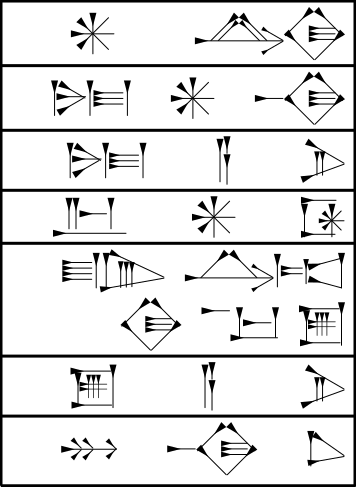

# Text 1: Temple dedication

{width=60%}

O texto é transliterado assim:

Index  Text                      Translation 
-----  ------------------------  ------------------
1.     ^{d}Nanna                 For Nanna
2.     nin-an-na(k)              the lord of heaven
3.     nin-a-ni.(r)              his lord
4.     Ur-d^Nammu                Ur-Nammu
5.     lugal-Urim5^{ki}-ma-ke4   the king of Ur
6.     é-a-ni                    his temple
7.     mu-na-dù                  he built

## Interpretação do Texto 1

Basicamente, o texto está dizendo que Ur-Nammu, rei de
Ur, construíu um templo para o Deus Nanna, Senhor do Céu.

## Verbs: principal parts

Para conjugar um verbo em inglês, precisamos conhecer
quatro de suas formas: (1) infinitivo; (2) past;
(3) past participle; (4) present participle. Abaixo
mostramos as partes principais de alguns verbos:

Meaning      Present      Past        Past participle
-----------  -----------  ----------  ----------------
construir    build        built       built
comprar      buy          bought      bought
morder       bite         bit         bitten
quebrar      break        broke       broken
escolher     choose       chose       chosen
vir          come         came        come
cortar       cut          cut         cut
fazer        do           did         done
beber        drink        drank       drunk
comer        eat          ate         eaten
pegar        take         talken      talked
mover        move         moved       moved
ganhar       earn         earned      earned
desejo       wish         wished      wished
seguir       arise        arose       arisen
batida       beat         beat        been
torna-se     become       became      become
dobrar       bend         bent        bent
sangrar      bleed        bled        bled
golpe        blow         blew        blown
